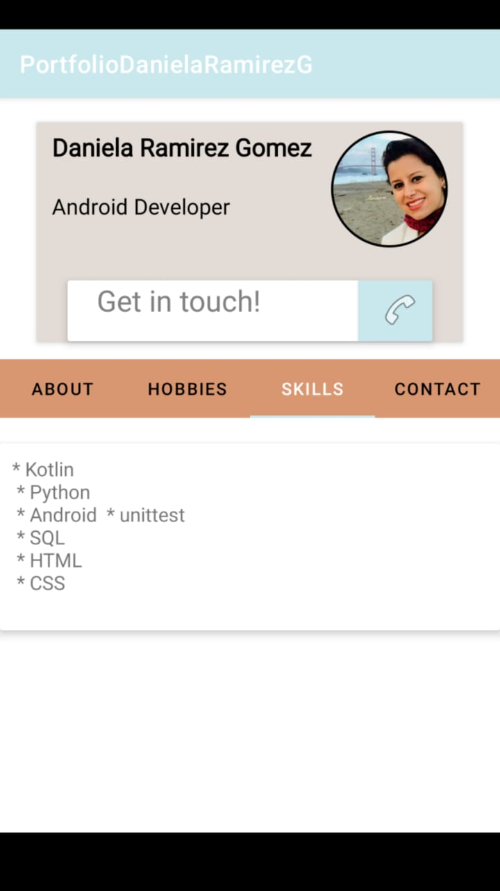

# kotlin-Portfolio-Daniela-Ramirez-G

This is an app that shows my portfolio, using fragments

## Code Source:
* [The visual code - Layouts](https://github.com/danyramirezg/kotlin-Portfolio-Daniela-Ramirez-G/tree/main/app/src/main/res/layout)
* [The Logic - MVC](https://github.com/danyramirezg/kotlin-Portfolio-Daniela-Ramirez-G/tree/main/app/src/main/java/com/dany/portfoliodanielaramirezg)

---

## Demo

## Author
* **Daniela Ramirez Gomez** - [danyramirezg](https://github.com/danyramirezg)

